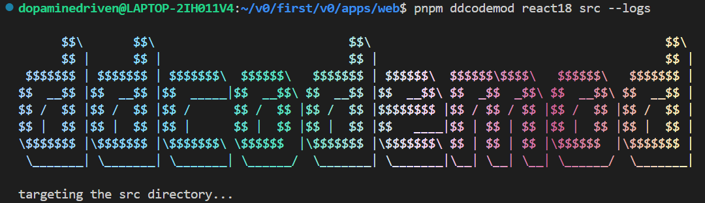

# @dd/codemod

Run a single command to effortlessly prepend Reacts "use client" flag in files matching client-only patterns.



- See the [executable](./src/bin/init.ts) file for instructions or run

```bash
npx ddcodemod --help
```

```bash
yarn ddcodemod --help
```

```bash
pnpm ddcodemod --help
```

### Package to be available on npm shortly
